# How engender is built

This is a map of the codebase for anyone about to change it: what runs where, how data moves, what is encrypted with what, and which tests prove which claims. It doesn't replace the sources of truth. It points at them.

## Contents

1. [What the app is](#1-what-the-app-is)
2. [Tech stack](#2-tech-stack)
3. [Repository layout](#3-repository-layout)
4. [Source layout and dependency direction](#4-source-layout-and-dependency-direction)
5. [Runtime processes](#5-runtime-processes-and-how-they-talk)
6. [Data model](#6-data-model)
7. [Security model](#7-security-model)
8. [Frontend](#8-frontend)
9. [Native layer](#9-native-layer)
10. [Testing](#10-testing)
11. [Performance](#11-performance-architecture)
12. [CI and release](#12-ci-and-release)
13. [Patterns used in the code](#13-paradigms-worth-knowing-before-editing)
14. [Common changes](#14-where-to-start-for-common-changes)

## Reading this guide

The implementation snapshot is `41db8fff`. Counts and recorded measurements
describe that snapshot; follow the source links to check later changes.

| Public reference | What it covers |
|---|---|
| [Project README](../README.md) | Product overview, local setup and build commands |
| [Contributing](../CONTRIBUTING.md) | Review, checks and integration rules |
| [Browser probes](../tests/PROBES.md), [CI guard roster](../tests/guards.json) | Browser checks and visual galleries |
| [Self-hosting](../deploy/SELF-HOSTING.md), [deployment](../deploy/README.md) | Hosting, releases and rollback |
| [Security policy](../SECURITY.md), [support](../SUPPORT.md) | Reporting problems without disclosing journal data |

<details>
<summary>Maintainer-only references</summary>

ADRs cited as `ADR-NNNN` live in `docs/adr/`. The domain glossary is
`CONTEXT.md`; product and screen briefs are `PRODUCT.md` and `SCREENS.md`.
`docs/agents/verification.md` and `docs/agents/platform.md` hold additional
test instructions. These files are excluded from the public repository, so
they are named here without links. Public contributors can use the rules
and implementation references in this guide; a change that needs additional
decision context should include that context in its review description.

[.gitignore](../.gitignore) excludes new files under [docs/](.). This guide, the two privacy
policies and the Markdown and JSON copy-coverage files are tracked
exceptions. Stage edits to tracked documents with `git add -u`; adding another ignored
document requires `git add -f`.

</details>

---

## 1. What the app is

engender is a private journal for a gender transition. One SvelteKit codebase ships to two places:

- **The web app (PWA).** A static SPA served by nginx from its own origin, cached by a service worker, with the journal kept in the browser's origin-private file system (OPFS).
- **The Android app.** The same static bundle inside a Capacitor 8 shell ([capacitor.config.ts](../capacitor.config.ts), appId `dev.engender.app`), served from `https://localhost` inside the APK. The database and files live in app-private storage, and Android Keystore protects the keys.

There are no accounts and no backend for journal data. Nothing leaves the device unless the person exports or shares it.

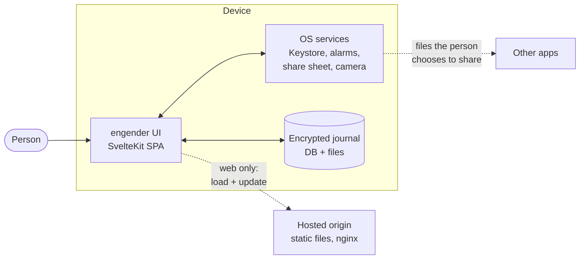

The hosted origin serves only static files: the app shell, chunks, fonts, icons, the manifest, the OCR engine and the PDF fonts. The page's CSP sets `connect-src 'self'`, restricting fetch, WebSocket and similar connections to that origin. This does not protect against compromised application code or every form of navigation. The Android app declares no `INTERNET` permission and cannot open network connections itself. Other apps and file providers chosen for export can have their own network access.

### Platforms side by side

| Concern | Web (PWA) | Android |
|---|---|---|
| Shell | Static bundle from nginx ([deploy/nginx/](../deploy/nginx)) | Same bundle in the APK, `https://localhost` origin |
| SQLite | SQLite3MultipleCiphers WASM (`@evolu/sqlite-wasm`) over the OPFS SAHPool VFS, in a worker ([src/lib/data/sqlite/mc-worker.ts](../src/lib/data/sqlite/mc-worker.ts)) | SQLCipher 4.9.0 through a local Capacitor plugin (`android/.../sqlite/`) |
| Files (photos, voice, video, documents) | OPFS, AES-GCM per file | App-private files, AES-GCM per file |
| Data-key storage | Wraps in OPFS JSON files; device-bound key in IndexedDB | Wraps in OPFS JSON files; device key wrapped by an Android Keystore key pair |
| Unlock options | Passphrase, PIN, WebAuthn PRF biometric, device-bound | Passphrase, PIN, device lock or biometric prompt, unlocked |
| Offline | Service worker, one cache per release (ADR-0021) | Bundle is local |
| Updates | New release waits until the journal is idle | App update |
| Background work | None | Reminders (AlarmManager), scheduled backups, retrospective notifications, widgets |
| Minimum runtime | Secure context with OPFS | WebView 87 (`minWebViewVersion`, ADR-0023), `minSdk` 26 |

## 2. Tech stack

Versions are the ones the lockfile installs ([package-lock.json](../package-lock.json)) and the Gradle files ([android/variables.gradle](../android/variables.gradle), [android/build.gradle](../android/build.gradle)) declare.

| Technology | Version | Role here |
|---|---|---|
| Svelte | 5.57.0 | UI, written in runes (`$state`, `$derived`, `$effect`) |
| SvelteKit | 2.70.3 | Routing and build. `ssr = false`, `prerender = false` ([src/routes/+layout.ts](../src/routes/+layout.ts)) |
| `@sveltejs/adapter-static` | 3.0.10 | Emits a static SPA with an `index.html` fallback. Capacitor wraps it unchanged |
| Vite | 6.4.3 | Bundler. Custom plugins in [vite.config.ts](../vite.config.ts) list emitted assets for the service worker and split the demo worker bootstrap |
| TypeScript | 5.9.3 | `strict: true`. `svelte-check --fail-on-warnings` treats Svelte warnings as errors |
| Capacitor core / android / app / cli | 8.5.1 / 8.5.2 / 8.1.1 / 8.5.2 | Android shell and bridge. `@capacitor/app` is the only official plugin; the other 16 are local |
| `@evolu/sqlite-wasm` | 2.2.4 | SQLite3MultipleCiphers WASM build used by the encrypted web driver (ADR-0020) |
| SQLCipher for Android | 4.9.0 | Android database. Chosen over the framework SQLite for FTS5, window functions and encryption (ADR-0020) |
| `hash-wasm` | 4.12.0 | Argon2id on the web, run in [src/lib/crypto/argon2id.worker.ts](../src/lib/crypto/argon2id.worker.ts) |
| Bouncy Castle | 1.80 | Argon2id on the native side, for scheduled archives made behind the bridge (ADR-0042) |
| `@inlang/paraglide-js` | 2.25.0 | Compiled English and Polish message catalogues |
| `d3-scale`, `d3-shape` | 4.0.2, 3.2.0 | Scales and path generators for SVG charts. Nothing else from d3 |
| `melt` | 0.30.1 | Headless behaviour for a few controls (`Slider`, `Switch`, `MediaTransport`) |
| `fflate` | 0.8.3 | Zip reading for the Daylio and Day One importers |
| `tesseract.js` (+ eng, pol data) | 7.0.0 | Lab-result OCR. Loaded on demand and cached afterwards |
| `pdfjs-dist` | 4.10.38 | Renders stored documents in a worker ([src/lib/data/documents/pdf-worker.ts](../src/lib/data/documents/pdf-worker.ts)) |
| Vitest | 4.1.11 | Node tier |
| `playwright-core` | 1.63.0 | Drives Chromium for the browser tier, guards and walkthrough |
| Android Gradle Plugin / Gradle | 8.13.0 / 8.14.3 | Android build; the wrapper is checksum-pinned |
| Android SDK | min 26, compile and target 36 | [android/variables.gradle](../android/variables.gradle) |
| `androidx.biometric`, `androidx.webkit` | 1.1.0, 1.14.0 | Keystore prompt; WebMessage listeners for the photo channels |
| Node.js | 24 | CI and local toolchain (README) |
| JDK | 21 | Android build (README) |
| nginx | `1.27-alpine`, pinned by digest | Self-host image ([deploy/self-host/Dockerfile](../deploy/self-host/Dockerfile)); production config in [deploy/nginx/](../deploy/nginx) |

Two policies apply to dependencies. [scripts/check-licences.mjs](../scripts/check-licences.mjs) keeps the npm graph to an explicit licence allowlist, because the app is GPL-3.0-only and F-Droid rebuilds it. [scripts/check-android-dependencies.mjs](../scripts/check-android-dependencies.mjs) keeps Firebase, Play Services, analytics and other proprietary SDK families out of the Android runtime graph.

## 3. Repository layout

```text
.
├── src/                 the app (SvelteKit)
│   ├── routes/          68 screens (+page.svelte), root +layout.svelte
│   ├── lib/             everything else, see section 4
│   ├── app.html         document template + pre-paint boot script
│   ├── hooks.server.ts  build-time only: holds module preloads
│   └── service-worker.ts
├── messages/            en.json, pl.json (3511 keys each), untranslated-literals.txt
├── project.inlang/      paraglide project settings
├── static/              fonts, icons, 16 palette favicons, manifests
├── android/             Capacitor project, 48 Java sources under app/src/main
├── tests/               non-unit tiers, guards, galleries, harness
├── scripts/             build, release, CI and check scripts (.mjs)
├── deploy/              nginx config, self-host Dockerfile, hosting docs
├── brand/mark/          the logo in svg/png/jpg + README
├── fixtures/released/   archives from released versions (format guard)
├── prototypes/          throwaway spikes kept for their findings
├── docs/                ignored except the privacy policies,
│                        the copy-coverage note and this file
└── .github/workflows/   ci.yml, release.yml, guard-recovery-proof.yml
```

Ignored working directories you will see in a maintainer's checkout:

| Path | What it is |
|---|---|
| `.scratch/<phase>/<feature>/` | The issue tracker. One markdown file per ticket; finished phases move under `.scratch/done/` (`docs/agents/issue-tracker.md`) |
| `.claude/` | Agent worktrees, audit evidence, review pages |
| `docs/adr/`, `CONTEXT.md`, `PRODUCT.md`, `SCREENS.md` | Decisions and briefs, kept out of the public tree |
| `build/`, `.svelte-kit/`, `dist/`, `ci-logs/` | Build output, release artifacts and kept CI logs |

Generated files, and where they come from:

| Generated | Produced by |
|---|---|
| `src/lib/paraglide/` | `paraglideVitePlugin` in [vite.config.ts](../vite.config.ts), compiled from `messages/*.json` |
| `src/lib/pwa/emitted-client-assets.generated.ts` | The `engender:emitted-client-assets` Vite plugin, on every build |
| `static/tesseract/`, `static/pdf-fonts/` | [scripts/prepare-vendor-assets.mjs](../scripts/prepare-vendor-assets.mjs) (runs on `postinstall` and `build`), copied from `node_modules` |
| `android/app/src/main/assets/public` and Capacitor plugin glue | `npx cap sync android` |
| [android/app/src/androidTest/assets/](../android/app/src/androidTest/assets) | [tests/android-tier/run.mjs](../tests/android-tier/run.mjs) |

Naming conventions you'll meet everywhere:

- `*.svelte.ts` modules use runes. Plain `*.ts` modules are rune-free and can be imported by the Node tier.
- `*.test.ts` sits beside the module it tests. The tiers are described in section 10.
- `*-bridge.ts` is the JS side of one native plugin. `android-*.ts` is Android-only code above a bridge.
- Branches and tickets are `ticket-NN-<slug>`. Comments name the ticket that introduced a rule ("phase 11 ticket 11"), and those tickets live in `.scratch/`.

## 4. Source layout and dependency direction

| `src/lib/...` | Holds |
|---|---|
| [data/](../src/lib/data) | The model: SQLite drivers and schema ([sqlite/](../src/lib/data/sqlite)), the journal facade and its areas ([journal/](../src/lib/data/journal)), the reactive layer ([live/](../src/lib/data/live)), preferences ([prefs/](../src/lib/data/prefs)), vocabulary labels ([vocabulary/](../src/lib/data/vocabulary)), the archive and importers ([archive/](../src/lib/data/archive)), media ([photos/](../src/lib/data/photos), [voiceRecordings/](../src/lib/data/voiceRecordings), [videoNotes/](../src/lib/data/videoNotes), [documents/](../src/lib/data/documents)), the demo persona ([demo/](../src/lib/data/demo)), plus about 100 pure domain modules (stock projection, hormone curves, agenda, wrapped...) |
| [crypto/](../src/lib/crypto) | AES-GCM, Argon2id and its worker, KDF profiles, keystore wrap format, recovery key |
| [lock/](../src/lib/lock) | Lock timing, PIN throttle, Keystore, lock-timing and screen-capture bridges |
| [stores/](../src/lib/stores) | App-level state in runes: the boot adapter and machine, lock, UI, toasts, media capture |
| [components/](../src/lib/components) | 129 top-level components, the control and reading kit (`kit/`), readings tiles (`readings/`), hub icon masks |
| [motion/](../src/lib/motion) | Motion primitives, tokens, press and material CSS |
| [theme/](../src/lib/theme) | Fonts, base tokens, 16 palettes, flag roles, active flag |
| [styles/](../src/lib/styles) | [app.css](../src/lib/styles/app.css), [components.css](../src/lib/styles/components.css), [kit.css](../src/lib/styles/kit.css), [screens.css](../src/lib/styles/screens.css), print CSS, class baselines |
| [navigation/](../src/lib/navigation) | Route policy ([routeGates.ts](../src/lib/navigation/routeGates.ts)), screen transitions, smart back, tab mapping, return context |
| [android/](../src/lib/android) | Plugin registry, launch routes, [platform-sync.ts](../src/lib/android/platform-sync.ts), back button, status bar |
| [pwa/](../src/lib/pwa) | Service-worker registration, update rule, shell asset split, SW messages |
| [audio/](../src/lib/audio), [charts/](../src/lib/charts) | Voice analysis (pitch, resonance, bands) and chart geometry |
| [disguise/](../src/lib/disguise), [unprompted/](../src/lib/unprompted), [reminders/](../src/lib/reminders), [retrospective/](../src/lib/retrospective), [onboarding/](../src/lib/onboarding), [permissions/](../src/lib/permissions), [print/](../src/lib/print), [media/](../src/lib/media), [a11y/](../src/lib/a11y), [resources/](../src/lib/resources), [document/](../src/lib/document) | One concern each |

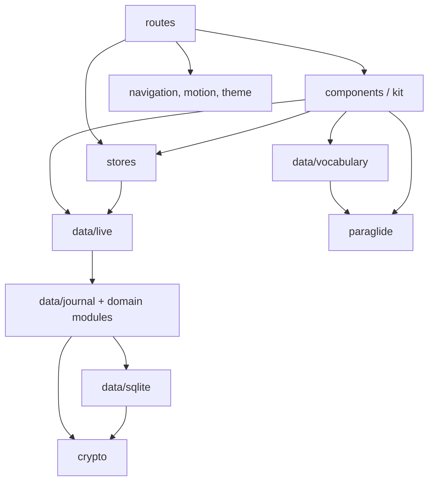

The direction rules:

- **[src/lib](../src/lib) never imports from `routes`.**
- **[data/journal](../src/lib/data/journal), [data/sqlite](../src/lib/data/sqlite), [data/live/writes.ts](../src/lib/data/live/writes.ts) and [crypto/](../src/lib/crypto) are rune-free and paraglide-free** (ADR-0016, ADR-0017). That is what lets the Node tier run them against real SQLite. A module that needs a locale gets one passed in from the presentation layer. The paraglide-bound edge of the model is [data/vocabulary/](../src/lib/data/vocabulary) (ADR-0024: screens read labels through [vocabulary.ts](../src/lib/data/vocabulary/vocabulary.ts); reference rows store keys).
- **Platform code sits behind ports.** Drivers implement `SqliteDriver` ([data/sqlite/driver.ts](../src/lib/data/sqlite/driver.ts)) and file stores implement `PhotoFileStore`. Boot, platform sync, route gates and the background schedulers take their dependencies as arguments from `+layout.svelte` or [stores/boot.svelte.ts](../src/lib/stores/boot.svelte.ts).

No single test enforces the direction as a whole. The Node tier enforces part of it, because a data module that picks up runes or paraglide stops loading there.

## 5. Runtime processes and how they talk

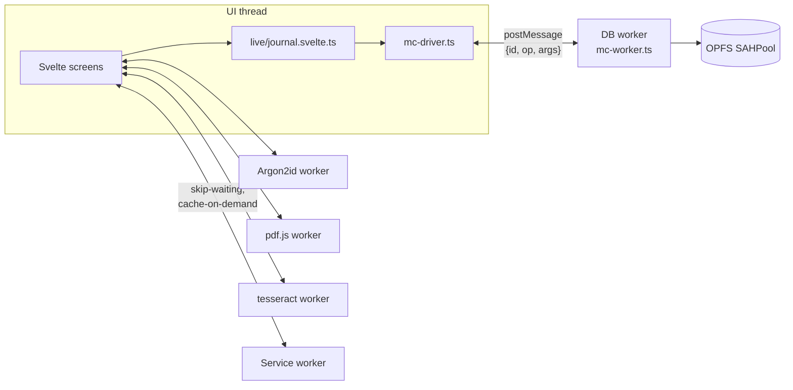

**Database worker (web).** [mc-driver.ts](../src/lib/data/sqlite/mc-driver.ts) sends `{ id, op, args }` messages and the worker answers `{ id, ok, result }` or `{ id, ok: false, error }`. The worker handles messages strictly in arrival order through one promise chain. Its handlers include `open`, query and run calls, the pre-migration copy (`VACUUM INTO` a URI that carries the same key) and `close`. Error text crosses the boundary as a string and never contains the key. The data key enters the worker once, as hex for `PRAGMA hexkey`.

Vite emits workers as ES modules so demo worker imports can split into chunks. The development and preview servers set COOP/COEP headers for SQLite; production hosting supplies those headers itself.

**Transactions.** Both drivers implement transactions as manual `BEGIN`/`COMMIT`/`ROLLBACK`, queued one at a time by `oneTransactionAtATime()` in [data/sqlite/transactor.ts](../src/lib/data/sqlite/transactor.ts). A transaction gets a scoped driver, and only that scope may run statements inside it. `readSnapshot()` gives a consistent multi-statement read. Unrelated calls wait until the reserved transaction or snapshot ends. Transactions don't nest. Entry trash and restore, tryout adoption, procedure deletion and doubt-snapshot deletion commit their related writes together. A failed file cleanup after commit logs a warning and leaves reclamation to the boot sweep; the committed write still succeeds.

Ordinary `SELECT` calls with identical SQL and scalar bindings share an answer within a driver read generation. The connection keeps at most 128 answers and returns separate row objects to each caller. Writes and transaction or snapshot boundaries discard those answers; scoped reads always reach SQLite, and rejected reads can retry. This saves repeated worker and Android bridge calls when several Home readers ask for the same rows.


**Android bridge.** On Android, [android-driver.ts](../src/lib/data/sqlite/android-driver.ts) talks to `SqlitePlugin` over the Capacitor bridge. Calls are pipelined (ADR-0089): each crosses as soon as it is made, carrying a session and a sequence number, and [CallSequencer.java](../android/app/src/main/java/dev/engender/app/sqlite/CallSequencer.java) runs them strictly in order on one thread. Bulk photo bytes skip the JSON bridge and go through two WebMessage channels (`PhotoPickChannel`, `PhotoWriteChannel`), registered with `WebViewCompat.addWebMessageListener` and limited to the `https://localhost` origin.

**Native plugins** are listed once in [src/lib/android/plugin-registry.ts](../src/lib/android/plugin-registry.ts), each with the JS module that owns it: `Sqlite`, `Keystore`, `PinBinding`, `Photos`, `Reminders`, `AutoExport`, `FileDelivery`, `RetrospectiveNotifications`, `Disguise`, `LockTiming`, `ScreenCapture`, `DeviceReset`, `Print`, `SensitiveClipboard`, `Permissions` and `StatusBarAppearance`, plus `@capacitor/app` for the back button. Every required plugin is checked at startup. The Java side registers them in [AndroidPluginRegistry.java](../android/app/src/main/java/dev/engender/app/AndroidPluginRegistry.java).

**Write notifications.** Every journal write announces the tables it touched. Live queries and the reference mirror react to that (section 6.4).

**Service worker.** It exchanges three messages, each defined once and imported by both sides: `engender:skip-waiting` and `engender:cache-on-demand` (OCR assets) in [src/lib/pwa/sw-messages.ts](../src/lib/pwa/sw-messages.ts), and `engender:cache-pdf-worker` in [src/lib/pwa/pdf-worker-cache.ts](../src/lib/pwa/pdf-worker-cache.ts).

Update discovery follows an installing worker until its state changes, so a mid-session release can be offered without another journal write. An explicit update check stops waiting for installation after 30 seconds; applying a waiting release still uses the separate five-second takeover limit.

Media capture guards the microphone-opening request as well as the live session. Leaving either voice screen aborts an unfinished open or discards the live take, and an inactive recorder preserves its captured bytes. Video re-encoding has bounded decode, playback and recorder-stop waits and returns the original-capture fallback when they expire. Android photo channels close their ports after 30 seconds without a reply. Both transports can retry through the bridge. PickedFiles retains a picked source until JavaScript acknowledges its bytes; timeout cancellation closes the channel reader and lets the bridge open a fresh stream from the same source. Late channel completion cannot close the newer chunk reader. Native reserves each file's write order when the channel header or bridge call arrives, so a late channel write finishes before any retry or restore writes newer bytes. A header with no payload expires after 30 seconds; other files can still write in parallel. Native read and write errors still propagate.

**Native into the app.** Notifications and widgets open the app through launch routes that carry a nonce (section 9).

**The external network** is the app's own origin, for the shell, updates and on-demand assets. Nothing else.

## 6. Data model

### 6.1 Schema and migrations

The whole schema is one statement, `BASELINE_SCHEMA` in [src/lib/data/sqlite/schema.ts](../src/lib/data/sqlite/schema.ts), registered as version 78. Before 1.0.0, the 78 forward-only migrations that used to build it were squashed into this baseline. [schema.test.ts](../src/lib/data/sqlite/schema.test.ts) holds the baseline byte-for-byte to the dump the old chain produced (`test-support/pre-squash-schema.txt`). Later versions are ordinary forward migrations in [migrations.ts](../src/lib/data/sqlite/migrations.ts) (ADR-0006), and `LATEST_SCHEMA_VERSION` in [schema-version.ts](../src/lib/data/sqlite/schema-version.ts) names the newest one. A test fails if the two disagree.

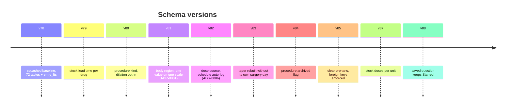

The rules:

- **Append only.** Never edit a shipped migration or the baseline. A journal whose `user_version` is above `LATEST_SCHEMA_VERSION` is refused with `SchemaTooNewError`, and the app shows [SchemaTooNew.svelte](../src/lib/components/SchemaTooNew.svelte) instead of guessing.
- **Nothing below the baseline.** A journal with a schema between 1 and the baseline comes from a development build from before the squash. The runner refuses it with `JournalBelowBaselineError` before copying or writing anything, and the boot-failure notice ([BootFailureNotice.svelte](../src/lib/components/BootFailureNotice.svelte)) says where it came from and offers the start-over way out instead of a retry. The notice speaks one sentence per failure kind (`BootFailure` in [boot-state.ts](../src/lib/stores/boot-state.ts)) and keeps the driver's text behind "Copy details for a bug report".
- **Copy before migrating.** Before migrating, the runner makes an encrypted pre-migration copy. A failed step rolls back and leaves that copy in place (ADR-0006).
- **Foreign keys are on.** Both drivers set `PRAGMA foreign_keys = ON` (the web worker and [SqliteConnection.java](../android/app/src/main/java/dev/engender/app/sqlite/SqliteConnection.java)). The migration runner turns them off only while it migrates. v85 cleared rows that had been orphaned while enforcement was off.
- **Two identities per row.** Each row has a local `INTEGER` rowid and a travelling identity: a minted `uuid` for the person's own rows, a seeded `key` for built-ins (ADR-0002). Archives and merges match on the travelling identity.
- **No derived state.** The schema stores rules and facts, not derived numbers (ADR-0010). Stock is a projection, not a count (ADR-0046). A reminder stores its rule, not its next fire time. The exceptions carry a comment in capitals at the table.
- **Dates are epoch days.** A date is an integer epoch day, meaning the local calendar day counted from 1970-01-01, never derived from UTC clock time (ADR-0001). The arithmetic lives in [data/epochDay.ts](../src/lib/data/epochDay.ts), which imports nothing. Timestamps are integer milliseconds. Day URL parameters are validated by [data/dayParam.ts](../src/lib/data/dayParam.ts): a nonnegative epoch-day integer, `today`, or a valid `YYYY-MM-DD` date. Invalid addresses keep the unavailable notice and Back control; `/entry/new/[day]` also refuses future days.
- **Native units.** Numbers are stored in the unit the person entered (ADR-0012). The one narrow exception is conversion for known analytes (ADR-0026).
- **Entry text search.** An FTS5 contentless table, `entry_fts`, holds folded entry text. Folding happens in application code (ADR-0005). Search outside entries is one SQL statement built from per-area column declarations ([journal/textSearch.ts](../src/lib/data/journal/textSearch.ts)).

### 6.2 Tables by area

The baseline groups its tables under headed sections. The diagrams below show the foreign-key edges that exist in SQL. Many links are deliberately not foreign keys, such as dose events, which don't reference their regimen episode. The comment at each table says why.

**Entry and its content**

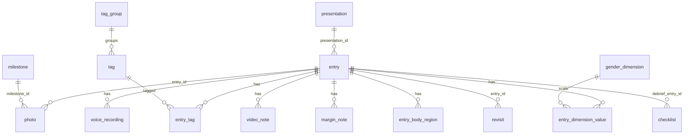

The same section holds `gender_preset`/`preset_dimension`, `body_region`, `entry_template` (with its tag and dimension children), `affirmation` and `presentation` (ADR-0048: a grouping key, never a set of scales). An entry is never deleted on the spot. `trashed_at` marks it, and boot purges trash older than 30 days.

**Care: regimen, doses, stock, labs**

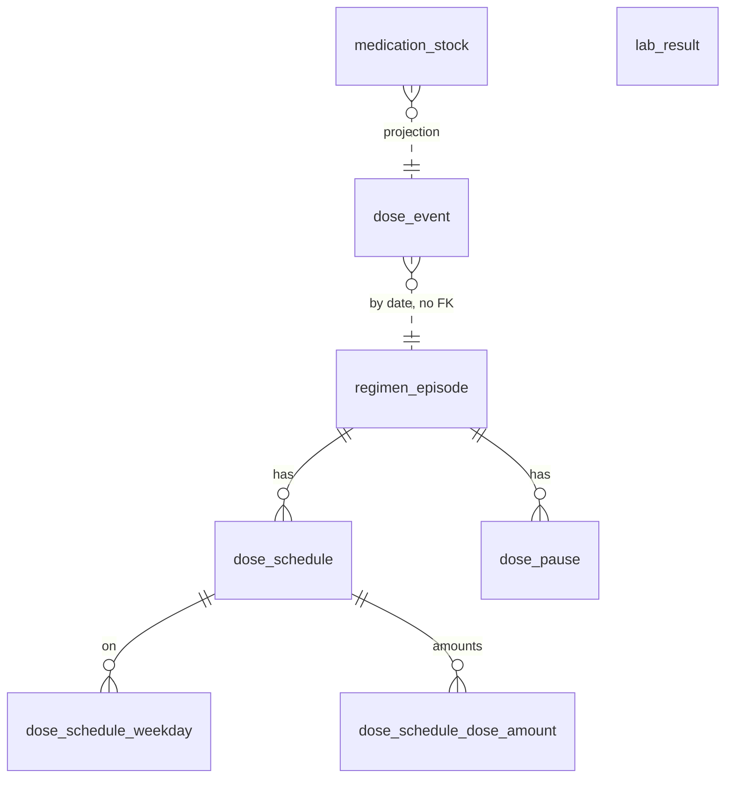

`dose_event` carries a `source` column: either the person logged it, or a schedule logged it automatically (ADR-0086). `medication_stock` has one row per drug, and the remaining stock is projected from it and from dose events (ADR-0046, [data/stockProjection.ts](../src/lib/data/stockProjection.ts)). An optional `doses_per_unit` says how many doses one unit holds, so a dose takes a fifth of a vial rather than a whole one; empty means one dose per unit. `taper` and `taper_session` belong to a procedure.

**Body, transition and the rest**

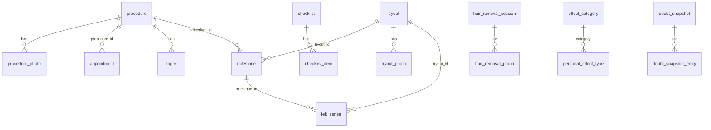

The rest, without SQL edges:

| Area | Tables |
|---|---|
| Body | `measurement_type`, `measurement`, `size_record`, `hair_stage`, `hair_photo`, `personal_effect`, `side_effect` |
| Voice | `voice_benchmark`, `voice_practice_take` |
| Logs | `tally_event`, `cycle_event` (ADR-0043), `wear_session` (ADR-0064), `journaling_pause` |
| Self | `letter` (seal derived from dates), `document` (ADR-0065), `roadmap_check`, `roadmap_goal`, `roadmap_track` (ADR-0068) |
| Eras and resurfacing | `era` (ADR-0049), `era_mute`, `comfort_item` |
| Housekeeping | `reminder`, `pref`, `word_frequency_ignore`, `saved_question`, `import_log`, `area_state` (hidden and finished areas, ADR-0052) |

[unprompted/resurfacing.ts](../src/lib/unprompted/resurfacing.ts) loads eras
and mutes for each registered resurfacing surface. On this day filters out
muted candidates before reading their content. Wrapped rejects the whole
period if it overlaps a muted era, including notifications and direct share
URLs. The interface requires a registered surface key; its type check rejects
missing and unknown keys. Direct Journal reads remain possible; code review
must check that resurfacing surfaces use this interface.

Count the tables with `grep -c '^CREATE TABLE' src/lib/data/sqlite/schema.ts`.

### 6.3 The journal facade

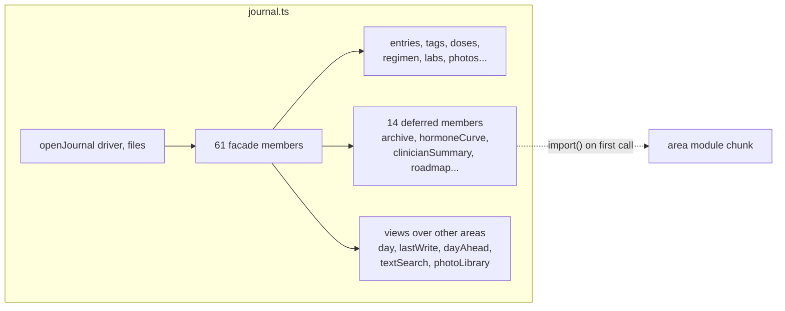

The journal is one handle bound to a driver (ADR-0017). `openJournal(driver, files)` in [src/lib/data/journal/journal.ts](../src/lib/data/journal/journal.ts) composes 61 facade members covering stored areas and computed views. A domain Area owns a kind of journal content and has an archive section that makes it portable. Code also uses the `*Area` type suffix for computed views: `day`, `lastWrite`, `dayAhead` and `textSearch` own no table. Facade operations are async and rune-free. Fourteen heavy members are deferred with `deferredArea()` ([journal/deferredArea.ts](../src/lib/data/journal/deferredArea.ts)), so their code loads on the first call while their type stays static. [deferredArea.test.ts](../src/lib/data/journal/deferredArea.test.ts) checks each deferred member's method list against the eager interface.

Facade-wide rules:

- An **update** that names an unknown id throws. A **delete** of an unknown id succeeds and changes nothing (ADR-0053).
- Contextual writes from the entry editor commit in one transaction (ADR-0044).
- An automatic trigger never creates a milestone without the person confirming it (ADR-0045).
- Preferences live in SQLite (the `pref` table). A small boot cache in `localStorage` holds what has to apply before the database opens: theme, palette, mood preset, language, accessibility, lock timing and disguise (ADR-0009, [data/prefs/boot-cache.ts](../src/lib/data/prefs/boot-cache.ts)). [data/prefs/catalogue.ts](../src/lib/data/prefs/catalogue.ts) declares every preference as either portable (it travels in archives) or device-local (ADR-0003), and a test fails if a preference is in neither list.

### 6.4 Reads, writes and live queries

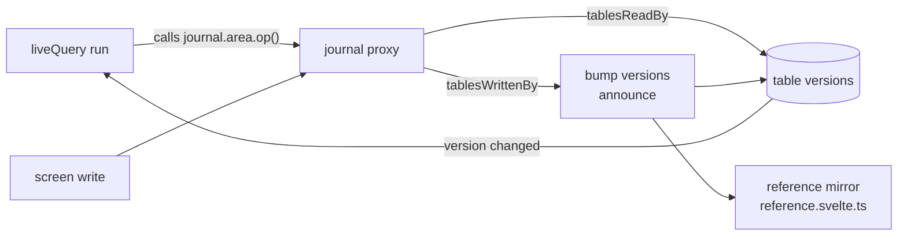

- **Every operation is declared.** [data/live/writes.ts](../src/lib/data/live/writes.ts) classifies every journal operation as a read or a write and names the tables it touches (52 coarse table names in `TABLE_NAMES`). The `OPERATIONS` table is checked at compile time against the `Journal` interface, and `observeWrites` throws at boot on anything unclassified.
- **The declarations are checked against SQL.** For operations and branches exercised by its fixtures, [writes.sql.test.ts](../src/lib/data/live/writes.sql.test.ts) checks that observed SQL tables fit within each operation's declarations. A separate union check requires coverage of the tables behind each coarse name. Redundant declarations can still pass, and unexercised branches, trigger/view internals and the file's explicit importer opt-outs remain outside that proof. Extend the fixtures when adding behavior.
- **Writes bump versions.** [live/journal.svelte.ts](../src/lib/data/live/journal.svelte.ts) exports `journal`, a proxy over the open journal. A write runs, then bumps a version for each of its tables ([tableVersions.svelte.ts](../src/lib/data/live/tableVersions.svelte.ts)). `batchWrites()` coalesces the bumps from a batch into one.
- **Reads re-run on their own tables.** `liveQuery(run)` records which operations its run called, maps them to tables with `tablesReadBy`, and re-runs only when one of those tables' versions moves. Saving a lab result doesn't re-run the entry list.
- **A refresh failure keeps the last result.** Read state is `{ value, loading, failed }` ([live/readState.ts](../src/lib/data/live/readState.ts)). A failed refresh keeps the previous result on screen and sets `failed`.
- **Locking on the web.** [stores/journal-session.ts](../src/lib/stores/journal-session.ts) is the lifecycle, rune-free. A lock in a lockable web mode closes the live facade's gate ([live/sessionGate.ts](../src/lib/data/live/sessionGate.ts)) and waits for every call already running, so a save in flight lands; flushes preference writes; closes the driver, which terminates the worker holding the hex key; stops handing the key out; drops the photo stores, the vocabulary mirror and the content caches ([lock/forget-content.ts](../src/lib/lock/forget-content.ts)); and starts a keyless worker for the next unlock. The unlock derives the key from the access mode's secret as before and reopens on that worker, about 30 to 80 ms measured in the browser tier. Calls made while locked queue at the gate and run against the reopened journal. The entry editor keeps its encrypted draft mirror when a lock unmounts it, so the unlock returns to the same draft.
- **Warm revisits paint at once.** [live/lastResults.ts](../src/lib/data/live/lastResults.ts) keeps each query's last answer in memory, stamped with its table versions. A revisit paints that answer in its first frame and refreshes underneath. The store is cleared on lock and on reset.
- **Reference data is mirrored.** Dimensions, tags, milestones and the rest of the vocabulary are bounded, so [reference.svelte.ts](../src/lib/data/live/reference.svelte.ts) keeps them in reactive state and re-reads them from SQLite after any write that touches them (ADR-0004).

### 6.5 Saving an entry, tap to repaint

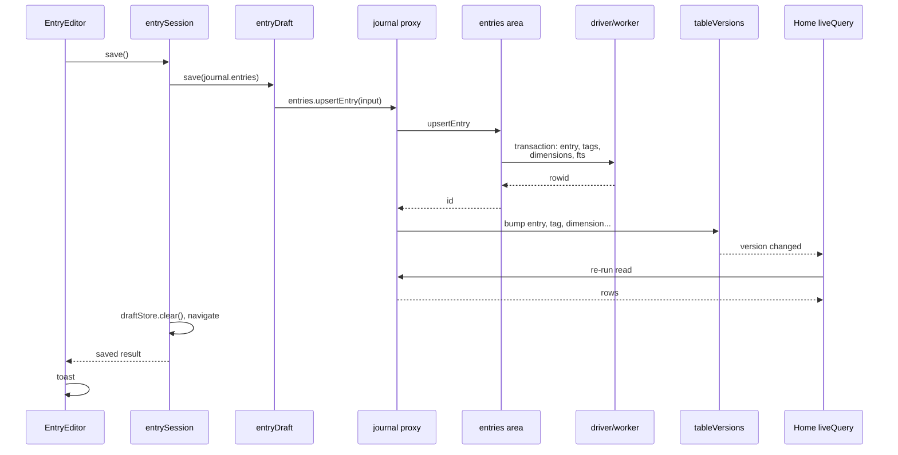

[components/entrySession.svelte.ts](../src/lib/components/entrySession.svelte.ts)
binds reactive state and the shared leave guard to the Node-tested lifecycle
in [entrySession.ts](../src/lib/components/entrySession.ts). The session waits
for draft restoration and media preparation before saving, retains an in-flight
save across a privacy lock, and resumes its draft only on the same route. A
failed first read leaves an existing entry uninitialized until a successful
retry, so saving cannot replace its content with a blank draft. The component
keeps capture, layout, focus and saved notifications.

The draft survives an Android process death through a sealed `localStorage`
mirror ([data/entryDraftStore.ts](../src/lib/data/entryDraftStore.ts),
[entryDraftPersistence.ts](../src/lib/data/entryDraftPersistence.ts)). Only the
current editor owns that mirror; a detached save cannot overwrite or clear a
newer editor's recovery.

### 6.6 Data lifecycle

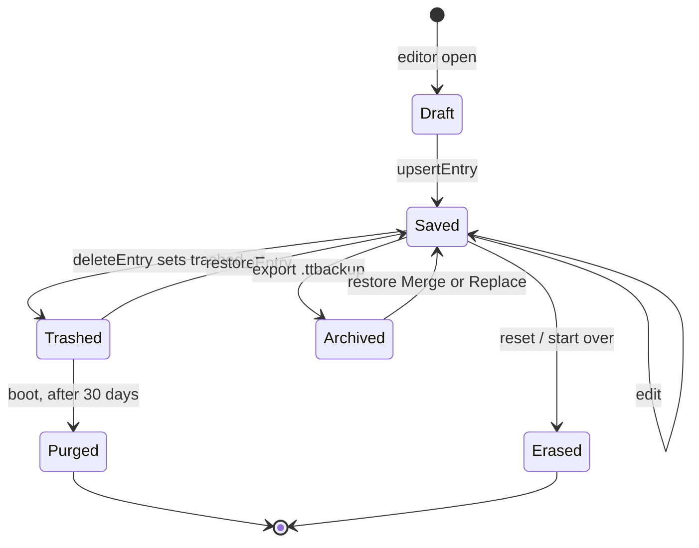

A boot sweep reclaims orphaned media files. Android's photo listing excludes dotfiles, so `.nomedia` survives the sweep, and native file operations accept only the photo directory or named test directories in debug builds. Both native photo-write transports sync their file before acknowledging success. Reset ([data/reset.ts](../src/lib/data/reset.ts), and `DeviceResetPlugin` on Android) wipes everything the installation holds: OPFS, the boot mirror, the device-key IndexedDB and the PIN bindings. It never touches an archive made earlier (ADR-0014).

### 6.7 Media files

Photos, thumbnails, voice recordings, video notes and documents live outside SQLite in one file store. The file names are opaque uuids, such as `<uuid>.webm` for a recording. `encryptedFileStore()` in [data/photos/encrypted-file-store.ts](../src/lib/data/photos/encrypted-file-store.ts) wraps the platform store (OPFS on the web, app-private files on Android). Each file is stored as a nonce followed by its AES-256-GCM ciphertext under the data key, with the file name as AAD. Photos are normalized and stripped of metadata on import (ADR-0008, ADR-0015). Photo picks accept source files up to 32 MiB before normalization; document picks keep their own 25 MiB ceiling. Both native read transports enforce the source ceiling when a provider omits or understates its size. Every photo is browsed in one library, but each table still owns its own photos (ADR-0085).

### 6.8 Archive format and restore

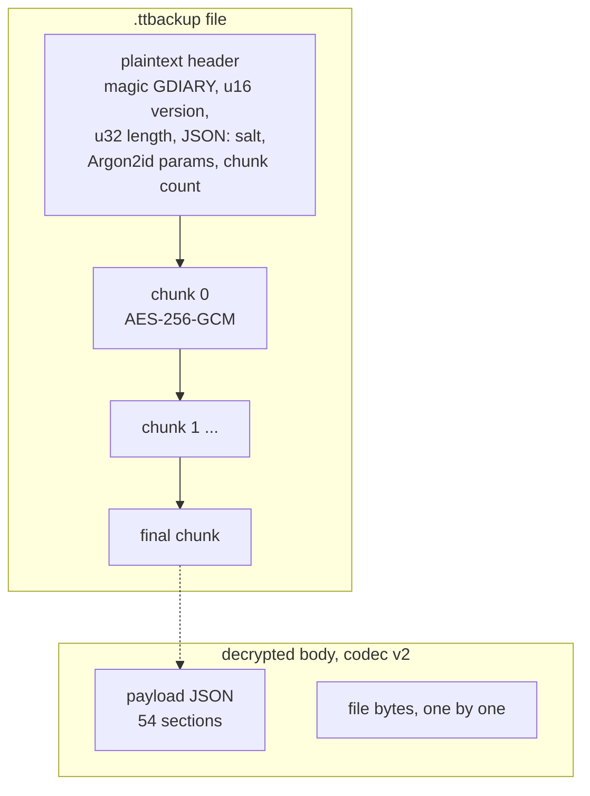

- **[container.ts](../src/lib/data/archive/container.ts) (ADR-0007)** owns the frame. Each chunk is about 1 MB and its AAD is the whole header plus the chunk index, so truncating, reordering or relabelling the file fails authentication. Header size and KDF parameters are bounded before anything is allocated. The key comes from the archive password through the archive Argon2id profile and has nothing to do with the journal's data key.
- **[codec.ts](../src/lib/data/archive/codec.ts)** owns the versioned body encoding. `ARCHIVE_CODECS` holds versions 1 and 2.
- **`payload.ts`** is the wire shape. It is deliberately separate from the domain types, so renaming something in the app can't change the format. `PAYLOAD_MIGRATIONS` brings old payloads forward one step at a time. [tests/released-formats.test.ts](../tests/released-formats.test.ts) reads archives from released versions in [fixtures/released/](../fixtures/released).
- **[journal/archiveSections.ts](../src/lib/data/journal/archiveSections.ts)** is the registry that makes an area travel (ADR-0027). Each of its 54 sections declares its name, the sections it depends on (`after`), what of it may leave in a shared structure file (`travels`), and how it is read and applied. A flat area declares its table once and gets both directions from that.

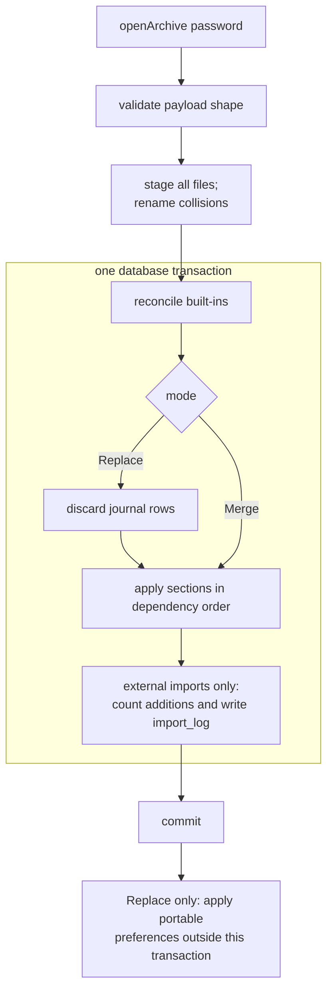

[journal/restore.ts](../src/lib/data/journal/restore.ts) stages every file before opening the database transaction. Existing file names receive fresh replacements, so staging cannot overwrite files the live journal still owns. Built-in reconciliation, Replace's row deletion and section application run inside the transaction. A failure rolls back those database changes. Cleanup removes unpublished replacements; remaining orphaned files wait for the boot sweep.

Replace keeps the built-in vocabulary and device-local preferences. Merge adds unmatched rows by uuid or key and leaves matching rows alone. Prep lists match by owner as well as uuid: incoming items join the existing list, including the standalone list. A procedure keeps its existing taper when the archive carries another. [journal/restoreFlow.ts](../src/lib/data/journal/restoreFlow.ts) applies portable preferences only after Replace returns, outside the row transaction. Merge preserves this device's preferences. Security preferences never travel. External import commits also measure additions and write `import_log` inside the row transaction.

**External importers** sit in [data/archive/sources.ts](../src/lib/data/archive/sources.ts), a registry of `daylio`, `daylio-backup`, `dayone`, `transtracks`, `trackAndGraph` and `pixels`. Each source detects its own bytes, parses them, previews the result and hands it to the ordinary Merge. Plain CSV and JSON exports ([archive/plain.ts](../src/lib/data/archive/plain.ts)) are readable files, not backups.

Importers deduplicate entry tags. Pixels preview reports `invalidMoodCount` for entries whose supplied scores fall outside 1 to 5; their mood becomes null. This count is part of the preview API; Pixels has no import screen yet. Archive restore also nulls invalid moods.

The Daylio backup picker refuses files larger than 1024 MiB before buffering them.
The shared [ZIP reader](../src/lib/data/archive/zipReader.ts) allows at most
1536 MiB of declared decompressed content across the members it reads, including
Day One and TransTracks imports. Both limits use a ten-year estimate: twice the
393.6 MiB attachment baseline in [the benchmark](../tests/long-journal/budgets.json),
plus 64 MiB for longer recordings, metadata and ZIP overhead, totals 851.2 MiB.
The factor of two allows larger source media than Engender's normalized photos;
it is an assumption, not a measurement of another app's export. The file limit
leaves room even if media barely compresses. These allocation limits do not
guarantee enough memory on every device. Engender's encrypted Archives use a
separate streaming reader.

## 7. Security model

### 7.1 Threat model

The things the app protects are journal content (the database, photos, voice, video and documents), the fact that the person uses this app, their chosen name, the data key and every secret (passphrase, PIN, recovery key, backup password), and exported archives.

| Adversary | Design answer |
|---|---|
| Shoulder-surfer | Gates show no journal data. Notifications are private and hide titles by default. Recents gets no screenshot. Disguise renames the app. |
| Someone holding the unlocked phone | Lock timing, PIN throttle, sensitive-clipboard clearing. |
| Someone holding the locked phone | Data is encrypted at rest. The data key is behind Keystore or an Argon2id wrap. Launch routes are nonce-gated. |
| Copy of stored app data | Database and files are ciphertext. Android Keystore keys are outside app-private files. A whole browser-profile copy can include the IndexedDB keys beside the web wraps; non-extractability alone does not protect that copy. |
| Malicious archive or import file | Bounded header and KDF parameters, authenticated chunks, a zip reader with size ceilings, `Map`-keyed importers, single-segment file names. |
| Malicious web content | Hash-based CSP with `connect-src 'self'`, no `unsafe-eval`, two constrained `{@html}` sinks, origin-locked WebMessage channels. |
| Supply chain | Lockfile installs, licence and Android-dependency policies, Gradle wrapper checksum, nginx pinned by digest, the third-party Play action pinned by SHA. |
| Backup and cloud sync | `allowBackup="false"`, and extraction rules exclude every domain from cloud backup and device transfer. |

These controls assume trusted application code, browser and operating system. Memory inspection, a compromised unlocked OS and use of an already unlocked app are outside the encryption guarantee (ADR-0018). On the web, a mid-session lock in a passphrase, PIN or biometric journal closes the database and drops the app's references to the data key (see "Locking on the web" below). It cannot promise to erase the key's bytes: JavaScript frees memory when the engine chooses. Android's lock hides the journal and keeps its key and database open.

Web PIN binding prevents guessing from `keystore.json` alone. Copying the whole browser profile can also copy the binding material, leaving the PIN's 10,000 candidates as the search space ([data/device-secret.ts](../src/lib/data/device-secret.ts), ADR-0041). Android keeps the binding key in Keystore, outside the app's files, though code running with the app's authority can ask it to sign. CSP limits browser requests; it does not protect plaintext or keys from compromised application code running on the trusted origin.

Report vulnerabilities as [SECURITY.md](../SECURITY.md) describes.

### 7.2 Keys

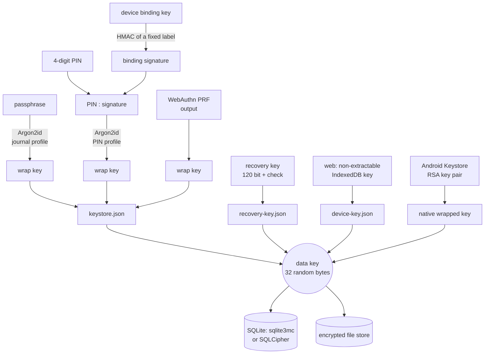

- **One random data key** encrypts the database and every file (ADR-0018, ADR-0020). Secrets only wrap it, and changing a passphrase rewraps the same key (`rewrapKeystore` in [crypto/keystore.ts](../src/lib/crypto/keystore.ts)).
- **KDF parameters are data** (ADR-0013, [crypto/params.ts](../src/lib/crypto/params.ts)). Each consumer has its own Argon2id profile (archive, PIN, journal), the profile is stored in the wrap, and older wraps keep opening after a re-tune. Each derivation runs in a worker that is terminated afterwards.
- **The PIN is bound to a device key** (ADR-0041): a non-extractable HMAC key in the browser, or a Keystore alias on Android. Without that binding, four digits would be too weak to wrap anything.
- **Android's device mode** wraps the data key with a Keystore RSA key pair whose private half never leaves Keystore. Replacing a wrap generates a second alias first, then atomically commits its alias and ciphertext and syncs the parent directory before removing the previous key. An error after publication keeps both aliases so either directory state remains openable. A retry syncs the current directory entry before reusing the alternate alias. Existing raw ciphertext wraps remain readable. The pair is bound to the device lock when the person wants a prompt, and unbound in "unlocked" mode.
- **The recovery key** is an optional second wrap (ADR-0054). It opens the journal on the device that holds the wrap. It cannot open an archive, and it cannot move a journal to another device.
- **Reminder payloads** on Android are wrapped under their own Keystore key (ADR-0047), so an alarm can fire without the journal being open.

### 7.3 Access modes and boot

`JournalAccessMode` ([data/journal-access-mode.ts](../src/lib/data/journal-access-mode.ts)) is one of `passphrase`, `pin`, `biometric`, `device-bound`, `unlocked`, or `null` before setup. A secret-backed keystore always wins over leftover device-bound material, so a crash midway through changing modes can't downgrade the journal. Browser device-bound metadata reuses its existing wrapping key, waits for an IndexedDB write to commit before publishing metadata, and aborts a failed OPFS write rather than closing a partial file.

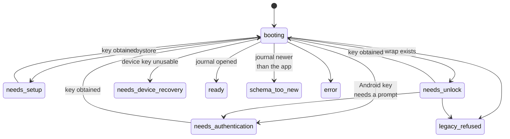

A web lock does not leave `ready`. Two events swap the journal handle a ready state holds: `journal-closed` sets it to null when a lock closes the database, and `journal-reopened` puts the reopened handle back.

These are the statuses in [stores/boot-state.ts](../src/lib/stores/boot-state.ts), and the edges are the ones its transitions allow. Only `booting` reaches `ready` or `schema_too_new`: a gate hands back to `booting` once a key is obtained (`resetToBooting`), and any state can fail into `error`. [stores/boot-machine.ts](../src/lib/stores/boot-machine.ts) is a pure reducer: an event comes in (`started`, `web-surveyed`, `android-surveyed`, `key-obtained`...) and it returns the next state and the effects to perform. [stores/boot.svelte.ts](../src/lib/stores/boot.svelte.ts) and [boot-platform.ts](../src/lib/stores/boot-platform.ts) are the effect interpreter. They do the I/O and decide nothing. The data key travels inside events and never lands in reactive state.

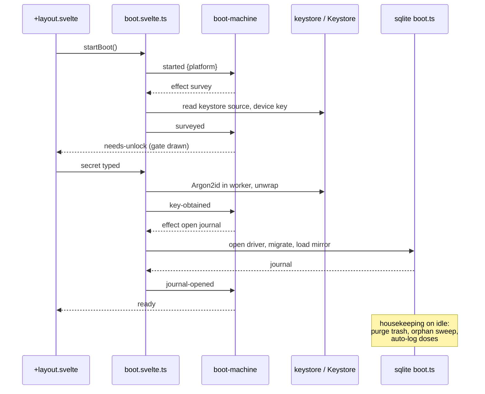

The order of the SQLite boot steps in [data/sqlite/boot.ts](../src/lib/data/sqlite/boot.ts) is load-bearing. Boot preferences apply before the database opens, then the database opens and migrates, then the mirror loads, then housekeeping runs off the critical path.

**Unsupported legacy storage.** [data/legacy-journal.ts](../src/lib/data/legacy-journal.ts) detects plaintext-era database files, side files and conversion markers. Boot refuses before creating or opening a journal, even if a keystore exists or the build is a demo. It leaves every legacy file untouched. Conversion and SQLocal have been removed.

### 7.4 Lock and lock timing

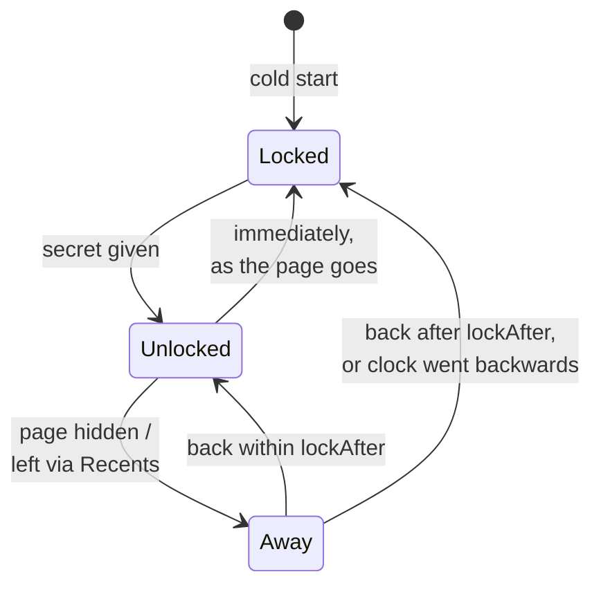

`lockAfter` is `immediately`, `one-minute`, `five-minutes` or `restart` ([data/prefs/catalogue.ts](../src/lib/data/prefs/catalogue.ts)). [lock/leave-lock.ts](../src/lib/lock/leave-lock.ts) checks elapsed wall-clock time when the person comes back, because a backgrounded WebView may never run a timer. On Android, `onUserLeaveHint` locks sooner. [stores/lock.svelte.ts](../src/lib/stores/lock.svelte.ts) holds `unlocked`, which starts as false on every load. [SessionUnlock.svelte](../src/lib/components/SessionUnlock.svelte) asks for the access mode's own secret again. The PIN wait grows with failed attempts ([lock/throttle.ts](../src/lib/lock/throttle.ts), [pin-throttle.ts](../src/lib/lock/pin-throttle.ts), and [PinAttemptWait.java](../android/app/src/main/java/dev/engender/app/lock/PinAttemptWait.java) on Android), using monotonic time. Android persists the deadline with the boot count and owes the full delay after a reboot. On the web, a reload owes the full pending delay unless the current session can prove elapsed time; changing the wall clock cannot pay it. A forgotten PIN can be recovered at the cold-start gate if a recovery key was created earlier and the journal and recovery wrap remain intact (ADR-0054). `SessionUnlock` does not offer recovery while the journal is already open. Without a usable credential or recovery key, a reset is needed before starting again or restoring an archive with its own password.

### 7.5 Disguise

[disguise/identity.ts](../src/lib/disguise/identity.ts) is the one place that answers what the app is called right now (ADR-0035). The pre-paint script in [src/app.html](../src/app.html) swaps the tab title, favicon and manifest before the first frame. On Android, `DisguisePlugin` switches between 33 launcher activity-aliases: the default and 15 pride flags, each in a square and a round version (32), plus one disguised alias named "Notes" in English and "Notatki" in Polish, with no round version (ADR-0088). Widgets drop their labels under disguise. Notification icons follow the disguise; the normal icon uses a monochrome engender mark. Android still exposes the application name in notifications and permission prompts. The web domain remains visible in the address bar, history, bookmarks and site settings. Backup, journey and wrapped export file names omit the person's name under disguise. Setup doesn't change with disguise and offers it last (ADR-0079).

### 7.6 Web hardening

- **CSP in the document.** [svelte.config.js](../svelte.config.js) writes the CSP as a meta policy in hash mode. It covers the two inline scripts, sets `connect-src 'self'`, and sets object and frame sources to none. The meta policy is the only CSP inside the Capacitor shell, because nginx headers never reach the APK.
- **nginx headers.** [deploy/nginx/journal-headers.conf](../deploy/nginx/journal-headers.conf) adds HSTS, COOP/COEP/CORP, `X-Frame-Options DENY`, `frame-ancestors` and a Permissions-Policy. [tests/csp.test.ts](../tests/csp.test.ts) checks the built document against the header list.
- **Service worker.** It answers same-origin GET requests only, never calls `clients.claim()`, and takes over only when a page asks it to (ADR-0021).
- **Separate origins.** The landing site and the journal live on different origins (ADR-0019).

### 7.7 Android hardening

- `allowBackup="false"`, plus [data_extraction_rules.xml](../android/app/src/main/res/xml/data_extraction_rules.xml) excluding every domain.
- No `INTERNET` permission. The declared permissions are notifications, exact alarms, boot-completed, audio record and settings, and camera.
- `MainActivity` is not exported. The `FileProvider` is limited to `cache/camera-capture/`. Capture output is deleted after consumption or cancellation, at the next app start, and when device stores are wiped.
- Recents: `setRecentsScreenshotEnabled(false)` on Android 13+ whenever a lock exists, and `FLAG_SECURE` on leave below 13.
- Notifications use `VISIBILITY_PRIVATE`, PendingIntents are immutable, and Capacitor logging is off (`loggingBehavior: 'none'`).
- Launch routes need a nonce (section 9).

## 8. Frontend

### 8.1 Svelte 5 conventions

- Runes everywhere. Module-level reactive state lives in `*.svelte.ts` files and is held in an object, such as `$state({ journal: null })`, because reassigning a bare module `let` doesn't reach readers in other modules.
- Logic that has a rule in it lives in a rune-free `.ts` file next to the reactive file, so the Node tier can test it: [readState.ts](../src/lib/data/live/readState.ts) beside [journal.svelte.ts](../src/lib/data/live/journal.svelte.ts), [boot-machine.ts](../src/lib/stores/boot-machine.ts) beside [boot.svelte.ts](../src/lib/stores/boot.svelte.ts), [tableVersions.notify.ts](../src/lib/data/live/tableVersions.notify.ts) beside [tableVersions.svelte.ts](../src/lib/data/live/tableVersions.svelte.ts).
- Screens read through `liveQuery`/`liveList` and write through `journal`. They never import a driver.
- A screen draws an edit draft through `kit/recordEditor.svelte.ts` or `kit/detailDraft.svelte.ts`, which expose `{ changed, saving, discard }`.
- Svelte transitions are local by default. Use `|global` when the block that toggles is not the transition's own.

### 8.2 The shell and route policy

[src/routes/+layout.svelte](../src/routes/+layout.svelte) is the composition root. It imports the global CSS, starts boot, and renders one of the gates in a single `{#if}` chain: `JournalGate`, `AndroidKeyGate`, `DeviceBoundRecovery`, `SessionUnlock`, `PostRecoveryAccessMode`, `SchemaTooNew`, or the route. It also passes ports into the policy modules:

| Module | Decides |
|---|---|
| [navigation/routeGates.ts](../src/lib/navigation/routeGates.ts) | What the person is owed before the URL's screen: `onboarding`, `close-chooser` (an access mode after a recovery unlock), `coming-back` (the return moment, ADR-0062), or nothing |
| [navigation/navigationTransition.ts](../src/lib/navigation/navigationTransition.ts), [screen-transition.ts](../src/lib/navigation/screen-transition.ts) | How one screen becomes another |
| [navigation/smart-back.ts](../src/lib/navigation/smart-back.ts), [sourceRecord.ts](../src/lib/navigation/sourceRecord.ts), [searchReturn.ts](../src/lib/navigation/searchReturn.ts), [scroll-region.ts](../src/lib/navigation/scroll-region.ts) | Where Back goes and what the previous screen looked like |
| [data/backgroundSchedulers.ts](../src/lib/data/backgroundSchedulers.ts) | When the Android auto-export and retrospective-notification checks run: on start, every 15 minutes and on return to the foreground |
| [android/platform-sync.ts](../src/lib/android/platform-sync.ts) | Everything that runs only on Android while the journal is open: reminder sync, stock run-out, launch routes, the back button, the disguise alias, the lock-timing mirror |

The return gap uses the median interval between distinct entry and dose writing days in the last year. One bounded query supplies those days; future records do not count.

### 8.3 The four doors

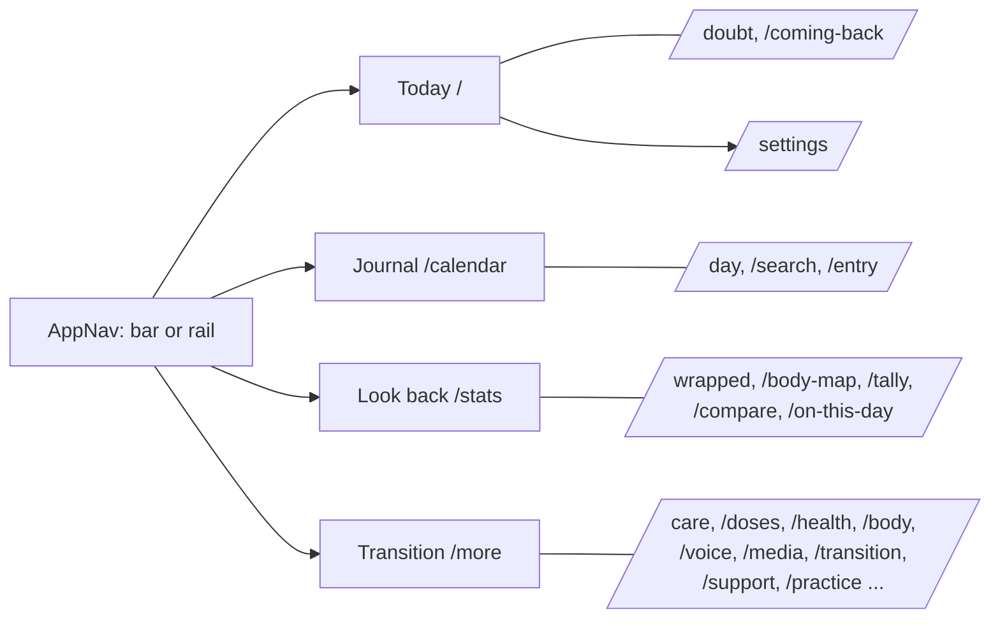

The `TAB_ROUTES` table in [navigation/active-tab.ts](../src/lib/navigation/active-tab.ts) maps route prefixes to tabs. The fourth door's `href` is `/more` and its key is `settings`, a split ADR-0036 makes on purpose. Under disguise it is labelled "More". Settings holds only preferences. Feature surfaces live in the hub, whose rows are declared in [data/hubRows.ts](../src/lib/data/hubRows.ts) (ADR-0072). Today's front page is pinned by the person and nothing ranks it centrally (ADR-0073). Live tiles are gated on data (ADR-0039). An area can be hidden and can be finished, and those are separate states (ADR-0052).

### 8.4 Kit, tokens, palettes and theme

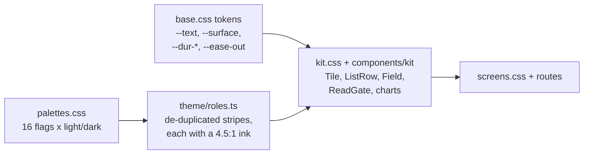

- `<html>` carries `data-palette`, the theme and the accessibility attributes, stamped before first paint from the boot cache.
- Colour appears only in a field and in blocks (ADR-0075). Each area of a screen takes one stripe of the active flag, and the assignment is categorical, never ordinal.
- Mood has its own scale, and each step picks its own ink (ADR-0025, ADR-0077, ADR-0091).
- A secondary button is a block of the page (ADR-0093).
- The pride flag motif appears only on Home and never under disguise (ADR-0035).
- [kit.css](../src/lib/styles/kit.css), [components.css](../src/lib/styles/components.css) and [screens.css](../src/lib/styles/screens.css) keep class baselines (`src/lib/styles/*-classes-baseline.txt`). `check:screens-classes` stops a screen-only class from spreading.

### 8.5 Motion system

Motion follows mechanical rules that tests and frame sweeps can check:

- **A state change moves** unless its ticket says why not (ADR-0078). Nothing should paint at its destination before it has travelled there, and no frame should have an element in neither place. In this codebase both of those count as a "yank".
- **Only transform, opacity and clip.** Height changes travel through primitives such as `resize`, `maskHeight`, `disclose` and `collapse` in [motion/reveal.ts](../src/lib/motion/reveal.ts), never by snapping. Late-arriving reads hold their room with `kit/ReadReserve.svelte` and [ReadGate.svelte](../src/lib/components/kit/ReadGate.svelte), then crossfade.
- **One easing and one set of durations.** [motion/tokens.ts](../src/lib/motion/tokens.ts) mirrors `--ease-out` and the `--dur-*` tokens for Svelte and WAAPI transitions, which CSS cannot reach.
- **Reduced motion.** [theme/base.css](../src/lib/theme/base.css) clamps durations to 1ms under reduced motion or `html[data-a11y-motion]`. [tests/motion-system.test.ts](../tests/motion-system.test.ts) requires every animation's end state to equal its element's resting state, so a clamped animation never strands an element.
- **Ambient motion has a budget** (ADR-0050, ADR-0051, ADR-0071).
- **Sweeps measure frames.** `npm run sweep:yanks` and `sweep:hydration` sample animated properties frame by frame.

### 8.6 i18n

- **Catalogues.** Paraglide compiles [messages/en.json](../messages/en.json) and [messages/pl.json](../messages/pl.json). The base locale is `en`, and the locale is resolved from `localStorage`, then the browser's preferred language, then the base locale ([vite.config.ts](../vite.config.ts)).
- **Human copy review.** `npm run strings` serves the local catalogue editor in [scripts/strings.mjs](../scripts/strings.mjs). Field saves compare the displayed value with disk before replacing it; bulk save uses the same operation and retains conflicting edits in the browser. Literal find-and-replace previews selected languages across shown or all keys, then applies replacements to drafts before saving. Individual and group checkboxes save fingerprints of the reviewed English/Polish pairs in `.scratch/copy-review.json`. Later copy changes invalidate approval for the affected keys. A filtered group checkbox applies only to the shown keys. Copy outside the catalogues (Android resources, web manifests, the store listing, the privacy policy by paragraph) is read by [scripts/strings-outside.mjs](../scripts/strings-outside.mjs) as values with their offsets, so a save splices one value into its file and leaves the formatting alone. This review state is local tooling data, separate from the journal and shipped catalogues.
- **Keys, not words, in the database.** Built-in rows store keys, and [data/vocabulary/](../src/lib/data/vocabulary) turns keys into words (ADR-0024).
- **Copy checks.** `npm run check:copy` checks that both catalogues have the same keys and that the count in [messages/untranslated-literals.txt](../messages/untranslated-literals.txt) never grows. `docs/ui-copy.md` is the copy guide.
- **Merging catalogues.** [scripts/merge-catalogue.mjs](../scripts/merge-catalogue.mjs) is a git merge driver that merges catalogues by key (README).

### 8.7 Accessibility conventions

- **Handles for tests.** Screens expose `data-*` handles, and the walkthrough grips those, never structure or wording (ADR-0029).
- **Touch targets** are 48px. A control drawn smaller keeps its drawing and takes `.hit-floor` ([components.css](../src/lib/styles/components.css)), a transparent box that adds only what is missing on each axis. Where that box would cover a neighbour, the control grows instead. The browser tier measures the touch-target and press-depth geometry of the control kit, and `tests/a11y-targets-large-text.mjs` measures the audited controls with `elementFromPoint` at 320 and 390px and 200% text.
- **Large text.** The bottom bar keeps every name on one line. When a name is wider than a fifth of the bar, as rendered with Android's text zoom, [AppNav.svelte](../src/lib/components/AppNav.svelte) puts the four tabs in two rows around the add button, and the scroll region's clearance follows the bar's measured height.
- **Contrast** floors are tested: [tests/kit-roles.test.ts](../tests/kit-roles.test.ts) and the palette contrast tests. Chart lines that carry a reading answer to 3:1 (WCAG 1.4.11). The line keeps the flag's stripe, and where the stripe is under 3:1 a casing in `--role-edge` (the same hue, moved in lightness, from `Role.edge` in [theme/roles.ts](../src/lib/theme/roles.ts)) is drawn under it. Every role of every palette is measured against the grounds a chart paints.
- **Reduced motion** is described in section 8.5.
- **Visible text first.** `aria-label` doesn't replace a card's visible reading.
- **Audit records.** `docs/accessibility-audit-2026-09-30*` holds the latest audit.

## 9. Native layer

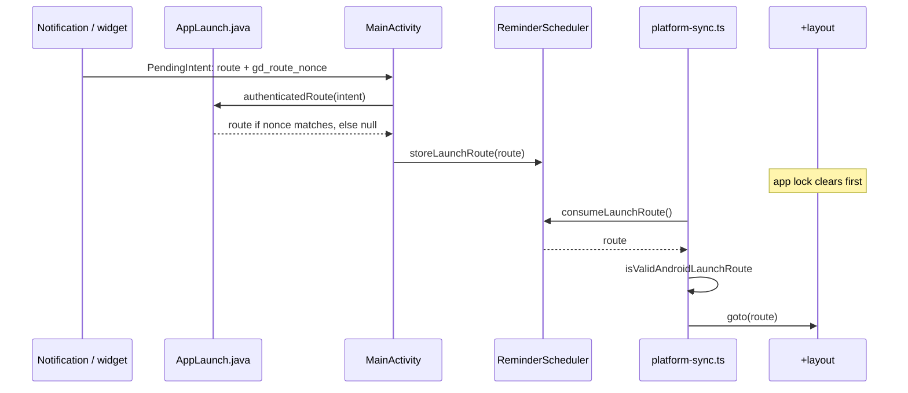

Launcher aliases are exported, so a route extra by itself proves nothing about who sent it. The nonce in [AppLaunch.java](../android/app/src/main/java/dev/engender/app/launch/AppLaunch.java) proves the app made the intent. The allowed route shapes are pinned on both sides by [src/lib/android/fixtures/launch-routes.json](../src/lib/android/fixtures/launch-routes.json), and navigation waits until the app lock has cleared.

The native features:

- **Reminders.** `RemindersPlugin` and `ReminderScheduler` schedule exact alarms. `ReminderAlarmReceiver` fires them, and `ReminderRescheduleReceiver` restores them after a reboot. Quiet hours and the payload store sit beside them.
- **Scheduled backups.** `AutoExportPlugin` derives the archive key natively (ADR-0042) and keeps the five newest verified automatic backups ([BackupRetention.java](../android/app/src/main/java/dev/engender/app/backup/BackupRetention.java)). Pruning follows verification and touches only recorded app-owned backups. A temporarily unavailable folder keeps its setting for a later retry. Changing or disabling the destination releases its persisted SAF grant. The scheduler admits one check at a time and reports failures from status lookup or snapshotting as well as packing and delivery.
- **Retrospective notifications.** These are the Wrapped and On-this-day notifications (`RetrospectiveNotificationsPlugin`).
- **Widgets.** `QuickLogWidgetProvider`, `TallyWidgetProvider` and `DoubtWidgetProvider` extend `DisguisableWidgetProvider`. Their taps are launch routes.
- **Everything else** is one plugin per concern: file delivery to the share sheet with encrypted staging, the camera through a `FileProvider` cache file, print, the sensitive clipboard, the status bar, permissions and device reset.

## 10. Testing

```mermaid
flowchart TB
  A["Android tier<br/>emulators, instrumentation"] --- B
  B["Walkthrough<br/>full app, demo build, 4 groups"] --- C
  C["Guards<br/>74 in tests/guards.json"] --- D
  D["Browser tier<br/>29 probes, real OPFS/WASM"] --- E
  E["Node tier, vitest<br/>525 test files, real SQLite"]
  F["Static: check, check:copy,<br/>licences, budgets"] -.- E
```

| Tier | Run | What it proves |
|---|---|---|
| Node | `npm test` | The data layer against real `node:sqlite` through `test-support` drivers; schema, migrations, archive round trips and golden archives; declarations against SQL; pure domain logic; machines and policies; stylesheet invariants. Build once first, because [csp.test.ts](../tests/csp.test.ts) reads `build/`. |
| Browser | `npm run test:browser` | [tests/browser-tier/](../tests/browser-tier): SQLite3MultipleCiphers on real OPFS, WebCrypto, canvas photo and video processing, the service-worker lifecycle, kit geometry and rendered screen contracts. Each check group declares how many checks it expects (`createReporter().block`), so a group that runs fewer fails. |
| Guards | `npm run test:guards`, `test:guards:built` | One Playwright script per regression, listed in [tests/guards.json](../tests/guards.json) (35 `dev`, 39 `built`) and run by [tests/run-guards.mjs](../tests/run-guards.mjs) with retry and shards. [tests/PROBES.md](../tests/PROBES.md) is the index; a probe that isn't indexed is deleted before its ticket merges. |
| Walkthrough | `npm run test:walkthrough` | [tests/walkthrough.test.mjs](../tests/walkthrough.test.mjs) drives the whole demo build through real flows by `data-*` handles. Four groups: journal, setup, features, actions. A full run takes about 15 minutes. |
| Built app | `npm run verify:build`, `verify:hosting` | Installed-PWA cold start, offline start, update and PIN; the nginx container's headers, cache rules and SPA routing. |
| Benchmarks | `npm run benchmark:long-journal`, `test:return-floor` | A ten-year fixture against [tests/long-journal/budgets.json](../tests/long-journal/budgets.json); the return-floor timing. |
| Android | `npm run test:android` | Instrumentation tests on the `gd26` and `tracker35` emulators: native SQLite features, Keystore behaviour, the encryption claim test, the contract suite in a WebView. JVM unit tests run with `./gradlew :app:testDebugUnitTest`. |
| Galleries | `npm run gallery:*`, `measure:*`, `sweep:*` | Renders and frame captures for review. Most of them gate nothing. |

Screen contracts use [mount-screen.ts](../tests/browser-tier/mount-screen.ts)
to render route components over seeded, open journals. The fixture attaches
the journal, hydrates reference data and opens the journal gate before mounting.
Home, Calendar and Settings assertions inspect DOM, computed styles and real
interactions in Chromium; they do not read component source. These suites stay
outside the Node tier, whose test drivers cannot provide browser storage.

The contract suite in [data/journal/contract-suite.ts](../src/lib/data/journal/contract-suite.ts) runs the same journal assertions against every driver: Node, the browser tier and Android.

**Fixtures and the demo.** [data/demo/persona.ts](../src/lib/data/demo/persona.ts) is "Alice", a seeded, deterministic persona about two and a half years into transition, generated relative to today. Every import of it sits behind `__DEMO__`, which a production build replaces with `false`. [verify-build.mjs](../tests/browser-tier/verify-build.mjs) greps the built bundle to prove the persona is gone. `VITE_DEMO=1 npm run build` produces the demo build that guards and the walkthrough use. [data/demo/fullFixture.ts](../src/lib/data/demo/fullFixture.ts) fills every feature. The long-journal fixture is a separate generator ([tests/long-journal/generate.ts](../tests/long-journal/generate.ts)).

`docs/agents/verification.md` lists what each tier needs and its known noise.

## 11. Performance architecture

```mermaid
flowchart LR
  subgraph First[first load, budgeted]
    Shell[app.html + kit/app chunks]
    Layout[+layout, gates, AppNav]
    JEager[eager journal areas]
    Boot[boot machine, drivers]
  end
  subgraph Later[on demand]
    Def[deferred areas:<br/>archive, hormone curve,<br/>roadmap, clinician summary...]
    Mig[migrations.ts]
    OCR[tesseract]
    PDF[pdf.js]
    Argon[hash-wasm in worker]
  end
  First -. "import()" .-> Later
```

**First load has a budget.** [scripts/check-first-load-budget.mjs](../scripts/check-first-load-budget.mjs) gzips every `/_app/immutable` URL that `build/index.html` asks for and compares the total with [scripts/first-load-budget.json](../scripts/first-load-budget.json). The budget is 105 files and 253,722 bytes (recorded 2026-10-01). A production build of this commit came to about 102 files and 250 KB. The file count gets no headroom, and the byte budget gets a 1 KB floor for hash wobble. A rebaseline has to name the change that caused it in the same file. The script also records a separate vendor-assets total for OCR and PDF fonts (about 22 MB gzip), without gating it. Its `onDemand` label describes this measurement bucket; PDF fonts are actually precached. CI gates the production build only.

**What stays out of first load:**
- deferred journal areas (section 6.3)
- [migrations.ts](../src/lib/data/sqlite/migrations.ts), because a journal already on the current schema never loads it
- `hash-wasm`, which the Argon2 worker bundles for itself
- most of the built-in vocabulary ([vocabulary/builtinTemplates.ts](../src/lib/data/vocabulary/builtinTemplates.ts) carries only what boot needs)

**Preload hints wait for the first frame.** [src/hooks.server.ts](../src/hooks.server.ts) runs once at build time and turns the document's module preload hints into held `x-modulepreload` hints. The pre-paint script in [app.html](../src/app.html) releases them after the first frame, so the splash paints before the chunk downloads compete with it. Over HTTP/2 at 4x CPU throttling and a slow network, the splash paints in under a second.

**The offline shell is one cache per release** (ADR-0021). A production precache is roughly 680 files and about 3 MB brotli: the app's chunks and CSS, the SQLite WASM, fonts and static icons. [src/lib/pwa/shell-assets.ts](../src/lib/pwa/shell-assets.ts) keeps the OCR engine and the PDF worker out of the install. A page asks for OCR through `engender:cache-on-demand` and the PDF worker through `engender:cache-pdf-worker`. PDF fonts are already precached. `registerServiceWorkerAfterBoot` ([src/lib/pwa/register.ts](../src/lib/pwa/register.ts)) schedules registration on browser idle after `ready` or `needs-setup`; returning users at an unlock gate wait until `ready`. This keeps registration out of initial boot work, though downloads can overlap later activity.

**One serialized database queue.** On the web, every statement goes to one worker and runs in arrival order ([mc-worker.ts](../src/lib/data/sqlite/mc-worker.ts)), so a screen's read cost is mostly round trips times their number. A round trip is a few to a few tens of milliseconds. On Android the queue is the bridge, which is why calls are pipelined with sequence numbers (ADR-0089) and why [tests/long-journal/budgets.json](../tests/long-journal/budgets.json) counts statements and bytes per screen mount (`mount-*`) as well as time.

**Other workers.** SQLite (web), Argon2id, pdf.js and tesseract each run off the UI thread. The SAHPool VFS gives the database synchronous OPFS handles inside its worker.

**Reads re-run narrowly.**
- Per-table versions keep re-runs scoped to the tables a read touched.
- `batchWrites` coalesces bursts of writes into one round of re-runs.
- A refresh that comes back equal leaves the screen untouched.
- `lastResults` paints a warm revisit from memory in its first frame.

A returning visit with a full fixture reaches ready in about 0.6 s at 4x CPU throttling, with first contentful paint under 100 ms.

**No layout jump on arrival.** Home's blocks answer out of many reads. [data/homeReserve.ts](../src/lib/data/homeReserve.ts) remembers how tall each block was last time, and `kit/ReadReserve.svelte` holds that room until the reads agree. [tests/tile-arrival-timing.mjs](../tests/tile-arrival-timing.mjs) and [tests/return-floor-check.mjs](../tests/return-floor-check.mjs) (`npm run test:return-floor`) guard arrival timing.

**Housekeeping runs on idle.** Trash purge, the orphan photo sweep and dose auto-logging start in an idle callback after boot reports ready ([data/sqlite/boot.ts](../src/lib/data/sqlite/boot.ts)). Auto-logging checks expected days with indexed timestamp probes in batches, then reads dose events only for underfilled days. It still checks historical slots on every pass so deleting an old automatic dose can recreate it; no stored cursor or derived checkpoint skips that history.

**Long lists and media are rendered lazily.**
- Long lists grow in rendered batches (`kit/BatchedList.svelte`, ADR-0069). A log that should grow only on request passes `autoGrow={false}`: the dose log does, so its day headings and older batches arrive through its show-more control, which discloses the new rows and collapses itself with its spacing once nothing is left.
- Photo thumbnails decode at 320x320 and load behind an IntersectionObserver.
- Object URLs are revoked when their element leaves.

**Benchmarks.** `npm run benchmark:long-journal` runs a ten-year fixture against [tests/long-journal/budgets.json](../tests/long-journal/budgets.json) and runs in CI as its own required job. Over that fixture:

| Operation | Time |
|---|---|
| Cold open | tens of ms |
| Decade of stats | single-digit ms |
| Archive encrypt or import | about a second |

The fixture holds 3,291 entries and 422 photos. The Android tier has its own long-journal run ([tests/android-tier/long-journal](../tests/android-tier/long-journal)).

## 12. CI and release

```mermaid
flowchart LR
  PR[push / PR / call] --> Node["node: build, types,<br/>vitest, copy, licences,<br/>classes, budget,<br/>progressive release"]
  PR --> And["android: build, cap sync,<br/>dependency policy,<br/>debug APK, F-Droid report"]
  PR --> Br["browser x7: browser-tier,<br/>4 walkthrough groups,<br/>installed-pwa, hosting"]
  PR --> G["guards: dev 3 shards,<br/>built 6 shards"]
  PR --> Bm[benchmark:<br/>ten-year journal]
  Node --> All{All required checks}
  And --> All
  Br --> All
  G --> All
  Bm --> All
```

- **[ci.yml](../.github/workflows/ci.yml) ("Checks")** runs on pushes, pull requests and `workflow_call`. The Node and Android jobs run their check lists through [scripts/run-ci-checks.mjs](../scripts/run-ci-checks.mjs), which keeps going after a failure and reports checks whose prerequisites failed as blocked. The `results` job, "All required checks", runs with `if: always()` and fails unless every upstream tier succeeded. The main ruleset requires that job, in strict mode with no bypass ([CONTRIBUTING.md](../CONTRIBUTING.md)).
- **[guard-recovery-proof.yml](../.github/workflows/guard-recovery-proof.yml)** is a manual, synthetic check of the guard runner's retry evidence.

```mermaid
flowchart LR
  Tag["signed tag v1.2.3<br/>npm run release:tag"] --> Checks[ci.yml via workflow_call]
  Checks --> Pub["publish: version from tag,<br/>notes from CHANGELOG"]
  Pub --> Sign[signed APK + AAB]
  Sign --> Verify[check-release-artifacts]
  Verify --> Pack["package-release:<br/>web bundle built twice,<br/>same digest"]
  Pack --> GH[GitHub Release<br/>+ SHA256SUMS]
  GH -. optional .-> Play[Play internal track,<br/>draft]
```

- **Versioning.** The public version comes only from a signed `v<semver>` tag (ADR-0022). [scripts/app-version.mjs](../scripts/app-version.mjs) reads it once, and an ordinary checkout builds as `0.0.0-dev`. [scripts/cut-release-tag.mjs](../scripts/cut-release-tag.mjs) refuses to tag unless `main` is clean and [CHANGELOG.md](../CHANGELOG.md) has a section for the version. [scripts/release-notes.mjs](../scripts/release-notes.mjs) requires the four call-outs: schema, archive format, security migrations and minimum version.
- **Hosting.** `npm run deploy:release`, `deploy:rollback` and `deploy:list` drive immutable web releases ([deploy/README.md](../deploy/README.md)). Rollback refuses code that can't open the current schema.
- **Progressive release.** Shipping goes through stages (`stage1` web beta through `stable`), each with a recorded release matrix: update, migration, archive round trip, scheduled backup and rollback. These are recorded in [scripts/progressive-release-record.json](../scripts/progressive-release-record.json) and checked by `check:progressive-release` (`docs/progressive-release.md`).
- **F-Droid** rebuilds with its own key, so moving between channels means reinstalling and restoring an archive.

## 13. Paradigms worth knowing before editing

| Paradigm | What it means here | Example |
|---|---|---|
| Registries checked by tests or types | When something must be listed somewhere, it's one array and a compile-time or test check catches anything left out | [journal/archiveSections.ts](../src/lib/data/journal/archiveSections.ts), [archive/sources.ts](../src/lib/data/archive/sources.ts), [unprompted/registry.ts](../src/lib/unprompted/registry.ts), [android/plugin-registry.ts](../src/lib/android/plugin-registry.ts), [tests/guards.json](../tests/guards.json) |
| Declarations checked against SQL | Reactive invalidation rests on declared tables, and the declarations are proven against recorded SQL | [data/live/writes.ts](../src/lib/data/live/writes.ts) + [writes.sql.test.ts](../src/lib/data/live/writes.sql.test.ts); composing reads in [live/test-support/composing-reads.ts](../src/lib/data/live/test-support/composing-reads.ts) |
| Pure machine, effect interpreter | Ordering-heavy flows are reducers returning effects, and a thin rune-bearing adapter performs them | [stores/boot-machine.ts](../src/lib/stores/boot-machine.ts), [data/labs/ocr-machine.ts](../src/lib/data/labs/ocr-machine.ts) |
| Ports passed in | Policy modules take their dependencies as arguments so the Node tier can test them with fakes | [navigation/routeGates.ts](../src/lib/navigation/routeGates.ts), [android/platform-sync.ts](../src/lib/android/platform-sync.ts), [stores/android-survey.ts](../src/lib/stores/android-survey.ts), [data/recovery-key.ts](../src/lib/data/recovery-key.ts) |
| Deferred areas | Heavy areas load on first call behind a static type | [journal/deferredArea.ts](../src/lib/data/journal/deferredArea.ts) |
| One owner per invariant | A rule lives in one module and everyone asks it | [disguise/identity.ts](../src/lib/disguise/identity.ts) (the name), [theme/activeFlag.svelte.ts](../src/lib/theme/activeFlag.svelte.ts) (the flag), [pwa/update.ts](../src/lib/pwa/update.ts) (when to update), [data/journal-busy.ts](../src/lib/data/journal-busy.ts) |
| Rune-free core | Anything with a rule is plain TypeScript, and runes sit only at the edge | [readState.ts](../src/lib/data/live/readState.ts) vs [journal.svelte.ts](../src/lib/data/live/journal.svelte.ts) |
| No derived state stored | Projections are computed, rules are stored | [stockProjection.ts](../src/lib/data/stockProjection.ts), [reminderRule.ts](../src/lib/data/reminderRule.ts) (ADR-0010, ADR-0046) |
| Travelling identity | uuid or key travels, rowid stays local | ADR-0002, [archive/payload.ts](../src/lib/data/archive/payload.ts) |
| Failure keeps what it had | Failed reads keep the last answer, failed migrations leave a copy, imports preserve existing files and roll back failed row changes | [live/readState.ts](../src/lib/data/live/readState.ts), ADR-0006, ADR-0011 |
| Ratchets with named changes | Budgets move only with a named change written beside the number | [scripts/first-load-budget.json](../scripts/first-load-budget.json), [tests/long-journal/budgets.json](../tests/long-journal/budgets.json) |

**Errors and observability.** Nothing reports usage or errors to any service, and there is no analytics. Failures surface to the person as toasts or notices in the app's own words ([archive/failure.ts](../src/lib/data/archive/failure.ts), [failureNotice.ts](../src/lib/data/archive/failureNotice.ts)). On the web, developer diagnostics go to the console only. Native code logs no secrets, and Capacitor's bridge logging is off. Support never needs journal data ([SUPPORT.md](../SUPPORT.md)).

## 14. Where to start for common changes

**Add a table or column**

1. Write a new migration in [src/lib/data/sqlite/migrations.ts](../src/lib/data/sqlite/migrations.ts) and bump `LATEST_SCHEMA_VERSION`. Never edit `BASELINE_SCHEMA`.
2. Write the area's methods in `src/lib/data/journal/<area>.ts` and compose it in [journal.ts](../src/lib/data/journal/journal.ts).
3. Classify every method in [data/live/writes.ts](../src/lib/data/live/writes.ts) and extend [writes.sql.test.ts](../src/lib/data/live/writes.sql.test.ts) to exercise its SQL. Section 6.4 describes the limits of that check.
4. If the data should travel, register a section in [journal/archiveSections.ts](../src/lib/data/journal/archiveSections.ts) (ADR-0027) and extend [archive/payload.ts](../src/lib/data/archive/payload.ts). A format change needs a payload migration.
5. Add the term to `CONTEXT.md`, and an ADR if a decision was made.

**Add a screen**

1. Create `src/routes/<path>/+page.svelte`, reading through `liveQuery` and building from the kit.
2. Map its prefix to a tab in [navigation/active-tab.ts](../src/lib/navigation/active-tab.ts). If it belongs in the hub, add a row in [data/hubRows.ts](../src/lib/data/hubRows.ts).
3. Add strings to both catalogues and expose `data-*` handles for the walkthrough.
4. Its motion follows ADR-0078. Index any probe you keep in [tests/PROBES.md](../tests/PROBES.md) and [tests/guards.json](../tests/guards.json).

**Add an external importer**

1. Implement parsing and preview resolution beside the existing importers, then add the source name and its `detect`/`preview` entry to [data/archive/sources.ts](../src/lib/data/archive/sources.ts). The registry has no separate `parse` member.
2. Add preview and commit methods to [data/journal/archive.ts](../src/lib/data/journal/archive.ts), classify them in [data/live/writes.ts](../src/lib/data/live/writes.ts), and use [data/journal/restore.ts](../src/lib/data/journal/restore.ts)'s `commitImport` so row changes, measured counts and import history share a transaction. Follow existing media normalization paths for imported files.
3. Connect file selection, preview, confirmation and failure messages in [src/routes/settings/export/+page.svelte](../src/routes/settings/export/+page.svelte), with both catalogues. Registration alone does not add an import flow to the screen.
4. Test malformed input, size limits, repeat imports and rollback after failure, using fixtures beside existing import tests or in [data/archive/fixtures/](../src/lib/data/archive/fixtures).

**Add a native plugin**

1. Write the Java plugin under `android/app/src/main/java/dev/engender/app/<concern>/` and register it in [AndroidPluginRegistry.java](../android/app/src/main/java/dev/engender/app/AndroidPluginRegistry.java).
2. Add a `*-bridge.ts` on the JS side and list it in [src/lib/android/plugin-registry.ts](../src/lib/android/plugin-registry.ts).
3. Keep `INTERNET` out of the manifest. Run [scripts/check-android-dependencies.mjs](../scripts/check-android-dependencies.mjs).
4. Cover it with JVM or instrumentation tests in the Android tier.

**Add a preference**

1. Declare it in [data/prefs/catalogue.ts](../src/lib/data/prefs/catalogue.ts) as portable or device-local, and add it to `BOOT_KEYS` if it has to apply before the database opens.

**Change crypto parameters**

1. Re-run `npm run benchmark:argon2` and record the result in an ADR (ADR-0013). Old wraps keep their stored parameters.

A note on one ADR: ADR-0090 describes LAN pairing between devices. No pairing code exists in the tree yet. The prototype under [prototypes/02-pc-browser-lan/](../prototypes/02-pc-browser-lan) holds its research.
